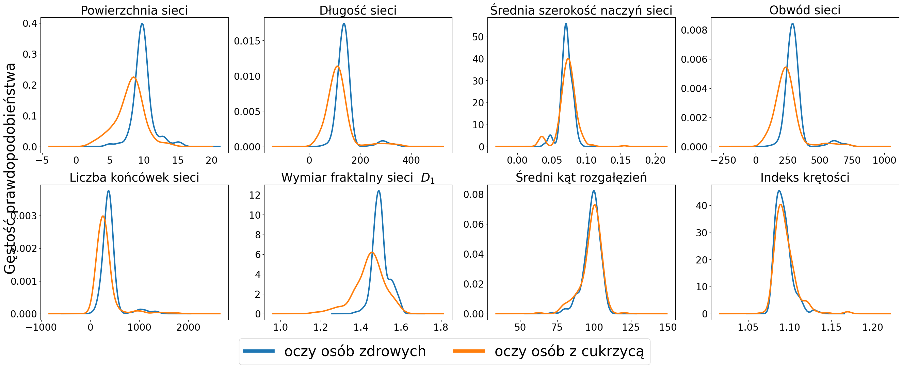
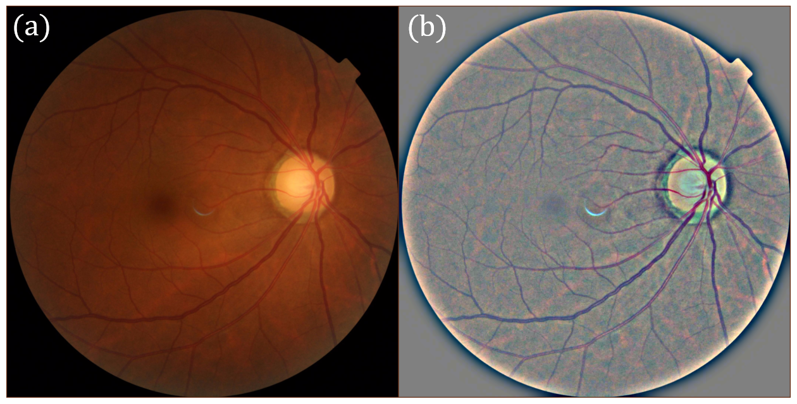
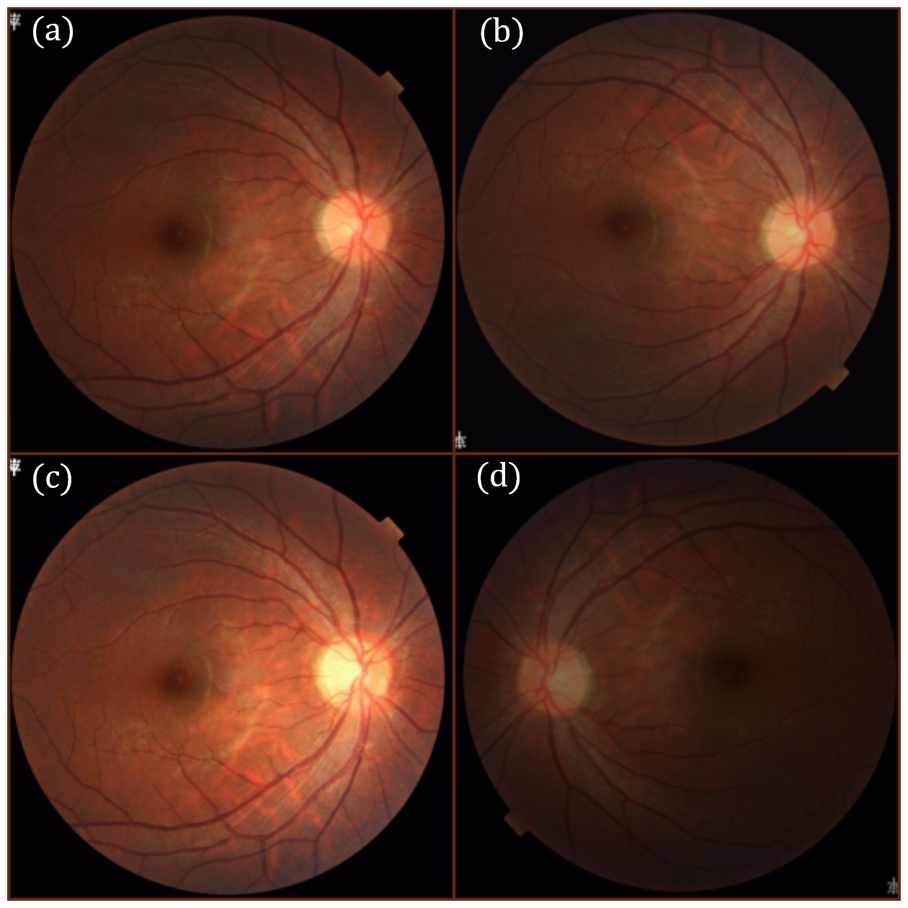

# Image Analysis and Diabetes Diagnosis Based on Fundus Photographs

This repository contains code and experiments related to the automatic detection of diabetes based on fundus photographs using deep neural networks and classical machine learning methods. The project explores the application of convolutional neural networks, morphological analysis, and hybrid approaches for the classification and segmentation of retinal structures.

## Project Overview

Diabetic retinopathy is one of the main complications of diabetes and a leading cause of vision loss among working-age people. This project investigates the effectiveness of automatic methods for diagnosing diabetic retinopathy through the analysis of fundus images, combining modern deep learning techniques with traditional morphological analysis methods.

## Datasets

Three fundus image datasets were used in the project:

### ARIA (Automated Retinal Image Analysis Dataset)
- Collected between 2004-2006 in the United Kingdom
- 61 individuals in the control group, 59 with diabetes, 24 with macular degeneration
- Contains manual vessel segmentations

### FIVES (A Fundus Image Dataset for Artificial Intelligence based Vessel Segmentation)  
- 800 high-resolution color fundus images
- Divided into four groups: control, diabetes, glaucoma, macular degeneration
- Segmentations performed by 27 medical experts

### HRF (High-Resolution Fundus Image Database)
- 45 images: 15 healthy patients, 15 with diabetic retinopathy, 15 with glaucoma
- Binary masks of manual vessel segmentations
- Developed by experts in retinal image analysis

The data was proportionally split into training, validation, and test sets, maintaining class balance.

## Methodology

### Data Preparation and Augmentation
- Images were rescaled to 300×300 (classification) and 256×256 (segmentation)
- Image transformation: rescaling to a uniform radius, subtraction of local color mean
- Data augmentation included:
  - Random vertical and horizontal flips  
  - Random changes in brightness, contrast, and color
  - Normalization and conversion to tensors
- For **classification**, models were trained on three types of input: raw fundus images, processed images, and vessel segmentation maps.
- For **segmentation**, models were trained on both raw and processed images.

### Model Architectures
- **DenseNet-121** for fundus image classification (healthy vs. diabetes)
- **TernausNet (U-Net)** for segmentation of retinal blood vessels
- **Classical models**: logistic regression, k-nearest neighbors, random forest based on morphological parameters from the PVBM package

### Loss Functions and Optimization
- **Cross-entropy** for classification
- **Negative Sørensen–Dice coefficient** for segmentation
- **AdamW** optimizer with weight regularization
- Training for 20 epochs (classification) and 35 epochs (segmentation)

### Evaluation Metrics
- **Accuracy**
- **Recall (Sensitivity)**
- **Precision**
- **F1 Score** (harmonic mean of recall and precision)
- **Matthews Correlation Coefficient (MCC)**
- **Specificity**

## Results and Discussion

Experiments were conducted with three types of classification models and four segmentation models. The best results were obtained for:

- **Classification**: DenseNet-121 trained on preprocessed fundus images achieved an accuracy of 92.9% and F1 score = 0.916
- **Segmentation**: TernausNet trained on preprocessed images without augmentation achieved an F1 score = 0.803
- **Classical models**: Random forest based on morphological parameters achieved the best results among traditional models (accuracy 85.4%, F1 = 0.846)

Morphological analysis was consistent with the scientific literature—differences in vessel area, length, and tortuosity were observed between healthy and diabetic groups.

### Quantitative Results

**Table 1: Classification results on the test set**

| Model | Loss | Accuracy | Recall | Precision | Specificity | F1 | MCC |
|-------|------|----------|--------|-----------|-------------|----|-----|
| Raw images | 0.275 | 0.914 | 0.850 | 0.953 | 0.925 | 0.880 | 0.817 |
| Preprocessed images | 0.189 | **0.929** | 0.851 | **0.999** | **0.999** | **0.916** | **0.866** |
| Binary segmentations | 0.419 | 0.829 | 0.878 | 0.803 | 0.803 | 0.830 | 0.667 |

**Table 2: Segmentation results on the test set**

| Model | Loss | Accuracy | Recall | Precision | Specificity | F1 | IoU |
|-------|------|----------|--------|-----------|-------------|----|-----|
| Raw without augmentation | 0.195 | 0.971 | 0.789 | 0.820 | 0.985 | 0.802 | 0.677 |
| Raw with augmentation | 0.198 | 0.970 | 0.788 | 0.814 | 0.985 | 0.798 | 0.672 |
| Preprocessed without augmentation | 0.199 | 0.969 | 0.811 | 0.792 | 0.982 | **0.803** | **0.678** |
| Preprocessed with augmentation | 0.195 | **0.971** | 0.788 | 0.822 | 0.985 | 0.799 | 0.673 |

**Table 3: Classical model results on morphological data**

| Model | Accuracy | Recall | Precision | Specificity | F1 | MCC |
|-------|----------|--------|-----------|-------------|----|-----|
| Logistic regression | 0.818 | 0.777 | 0.840 | 0.857 | 0.808 | 0.637 |
| k-NN | 0.818 | 0.815 | 0.815 | 0.821 | 0.815 | 0.636 |
| **Random forest** | **0.854** | **0.815** | **0.880** | **0.893** | **0.846** | **0.710** |

## Visualization of Segmentation Results

The image below illustrates the visual differences between raw and processed fundus images.

## Data Augmentation Examples

Below is an example of data augmentation techniques used in the project:

*A comparison of an image from the database and its sample transformations performed for data augmentation purposes. a) Original image. b) Image flipped horizontally with reduced brightness. c) Image with increased brightness and contrast. d) Image flipped both horizontally and vertically with reduced brightness.*

# PLOTS
## Clasification based on raw image

## Clasification based on procesd image

## Clasification based on  binary vessel map

## Segmentation based on raw image

At the third picture black pixels indicate true positives (TP), red indicates false positives (FP), and blue indicates false negatives (FN).

### without augmentation

### with augmentation

## Segmentation based on procesd image
### without augmentation

### with augmentation

